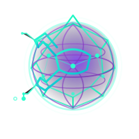

<p align="center">
  
</p>

<h1 align="center">WebClaw</h1>

<p align="center">
  <strong>Browser-native AI agent. WebGPU compute. Claw Mesh. Zero install.</strong><br/>
  An independent student project inspired by the <a href="https://github.com/Clawland-AI">Clawland ecosystem</a>.
</p>

<p align="center">
  <a href="https://github.com/Vasanthadithya-mundrathi/webclaw/stargazers"></a>
  
  
  
  
</p>

---

## What is WebClaw?

WebClaw is an experimental **browser-native AI agent** built over the last 2 weeks. It explores what happens when you run an agent entirely inside the browser with no local install required. Open a tab on your laptop, login with your UID, and your agent is live. Want to access it from your phone on the couch? Just open the URL and login with the same UID.

> **WebClaw is a peer mesh of browser agents. The browser is the runtime. The OS is an optional, on-demand extension via Native Messaging. There is no daemon, no config file, no server, and absolutely NO OPEN PORTS.**

This is architecturally different from OpenClaw (Node.js daemon) and PicoClaw (Go binary). I built this because I am fundamentally afraid of opening random ports on my only laptop, and I wanted a lightweight way to experiment with agentic meshes without needing a Mac Mini farm.

Read the full story here: [Introducing WebClaw: The Browser-Native AI Mesh](https://vasanthadithya-mundrathi.github.io/Blog/posts/2026/03/11/webclaw-browser-native-mesh/)

---

## Architecture

```
┌─────────────────────────────────────────────────────┐
│                  Browser Tab (WebClaw)               │
│                                                      │
│  ┌──────────────┐   ┌──────────────┐                │
│  │  Agent Loop  │◄──│  Tool Registry│               │
│  │  (React)     │   │  (18+ tools) │                │
│  └──────┬───────┘   └──────────────┘                │
│         │                                            │
│  ┌──────▼──────────────────────────────────────┐    │
│  │           Core Modules                       │    │
│  │  • OPFS Workspace (private IDENTITY.md etc.)│    │
│  │  • WebGPU Vector Store (GPU-accelerated)    │    │
│  │  • CGEP Gene Engine (self-evolving)         │    │
│  │  • Trust Shield (per-tool security)         │    │
│  └──────────────────────────────────────────────┘  │
│                                                      │
│  ┌──────────────┐   ┌──────────────┐               │
│  │  Claw Mesh   │   │  Web Worker  │               │
│  │ BroadcastCh. │   │  Subagents   │               │
│  └──────────────┘   └──────────────┘               │
└─────────────────────────────┬───────────────────────┘
                              │ Native Messaging (optional)
                    ┌─────────▼──────────┐
                    │    ClawOS Agent    │
                    │  (os-agent/       │
                    │   Node.js script)  │
                    └────────────────────┘
```

### Key Differentiators

| Feature | WebClaw | OpenClaw | PicoClaw |
|---|---|---|---|
| **Primary focus** | Browser/Mobile | Cloud/Desktop Runtime | Edge Devices ($10 SBCs) |
| **Install required** | ❌ Zero (URL + UID) | ✅ Node + npm | ✅ Go binary |
| **Open Ports** | ❌ Zero | ✅ WebSocket / API | ✅ API |
| **WebGPU compute** | ✅ World first | ❌ | ❌ |
| **Gene Evolution** | ✅ JS port (CGEP) | ❌ | ✅ Pioneer |
| **Peer mesh agents** | ✅ BroadcastChannel | ❌ | ❌ |
| **OS bridge** | ✅ Native Messaging | ✅ CDP | ❌ |

---

## Features

### 🦀 Claw Mesh (Zero-Server P2P)
Every open WebClaw tab is a named agent that discovers peers via `BroadcastChannel` — no WebSocket, no server. Open two tabs and they auto-discover each other. Use the `mesh_delegate` tool to send tasks between agents.

### ⚡ WebGPU Vector Store
Vector embeddings and semantic search run directly on the GPU via WebGPU compute shaders. 30x faster than JavaScript alone. Your personal knowledge base lives in OPFS, never uploaded anywhere.

### 🧬 CGEP Gene Engine
The agent learns from every task. Successful behaviors are crystallized into reusable "genes" (topic, trait, confidence score) stored in `GENES.json`. Ported from PicoClaw's Cognitive Gene Evolution Protocol.

### 🤖 Web Worker Subagents
Spawn isolated background agent threads from the Mesh panel. Each Worker has its own system prompt, LLM config, and conversation context. The main tab is the Orchestrator; workers are Specialists.

### 🖥️ ClawOS (On-Demand OS Bridge)
A one-time local install (`node os-agent/install.js`) registers a Native Messaging Host with Chrome. It wakes up on-demand, executes a command, and shuts down — no persistent daemon, no open port.

### 🔒 Trust Shield
Toggle security levels per tool: Sandboxed (read-only external content), Confirm (approval modal), or Trusted (full autonomous). Web content is tagged `[UNTRUSTED]` and cannot modify your workspace without approval.

### 📂 Workspace Explorer
All files are stored in the browser's **Origin Private File System (OPFS)** — a sandboxed area separate from your OS filesystem. View, edit, download, upload, and delete files from the Workspace panel.

Core workspace files:
- `IDENTITY.md` — Agent's self-description and goals
- `USER.md` — Your name and preferences
- `MEMORY.md` — Persistent memory, auto-updated by the agent
- `AGENTS.md` — Agent configs
- `GENES.json` — Crystallized behavioral genes
- `VECTORS.json` — Semantic vector store index

---

## Quick Start

### Option 1: Just open the app
```
# Clone and run
git clone https://github.com/Vasanthadithya-mundrathi/webclaw.git
cd webclaw/frontend
npm install
npm run dev
```
Open `http://localhost:5173` — follow onboarding.

### Option 2: Hosted
Visit the docs landing page at `docs/index.html` (self-hosted — deploy to Vercel/Netlify/GitHub Pages).

---

## Supported LLM Providers

| Provider | Models | Notes |
|---|---|---|
| **Cerebras** | `llama3.1-8b`, `llama3.3-70b` | Ultra-fast, free tier |
| **Gemini** | `gemini-2.5-flash`, `gemini-2.0-flash`, etc. | Google, free tier limited |
| **Groq** | `llama-3.3-70b-versatile`, `mixtral-8x7b` | Fast free tier |
| **OpenAI** | `gpt-4o`, `gpt-4o-mini` | Paid |
| **Anthropic** | `claude-3-5-sonnet`, `claude-3-5-haiku` | Paid |
| **OpenRouter** | All models | Multi-model gateway |

API keys are stored only in your browser's `localStorage`. They never leave your device.

---

## Project Structure

```
webclaw/
├── frontend/              # React + TypeScript + Vite app
│   └── src/
│       ├── agent/         # Agent loop, channel bridge
│       ├── mesh/          # Claw Mesh (BroadcastChannel)
│       ├── os/            # ClawOS bridge (Native Messaging)
│       ├── providers/     # LLM adapter (Gemini, Cerebras, OpenAI...)
│       ├── tools/         # Tool registry (18+ tools)
│       ├── ui/            # React components
│       ├── workers/       # Web Worker subagents + useSubagents hook
│       ├── workspace/     # OPFS manager, settings, CGEP genes, vectors
│       └── types.ts       # Shared TypeScript types
├── backend/               # Thin Node.js bridge (optional, for Telegram)
├── extension/             # Chrome/Firefox browser extension (tab control)
├── os-agent/              # ClawOS Native Messaging Host (Node.js)
│   ├── index.js           # Native messaging host
│   └── install.js         # Installer for Chrome/Firefox
└── docs/                  # Landing page (HTML)
```

---

## Tools Available to the Agent

| Tool | Description |
|---|---|
| `web_search` | DuckDuckGo search |
| `web_fetch` | Fetch and parse any URL |
| `workspace_read` | Read a file from OPFS |
| `workspace_write` | Write a file to OPFS |
| `workspace_list` | List all OPFS files |
| `memory_append` | Append to MEMORY.md |
| `webgpu_vector_add` | Embed text into the GPU vector store |
| `webgpu_vector_search` | Semantic search over stored vectors |
| `cgep_crystallize` | Save a gene (behavior pattern) |
| `cgep_devolve` | Remove a gene |
| `tab_read` | Read DOM of a browser tab (extension) |
| `tab_screenshot` | Screenshot a tab (extension) |
| `tab_click` | Click an element in a tab (extension) |
| `tab_navigate` | Navigate a tab to a URL (extension) |
| `mesh_delegate` | Send a task to a Claw Mesh peer |
| `os_run` | Run a shell command via ClawOS |
| `os_read` | Read an OS file via ClawOS |
| `os_write` | Write an OS file via ClawOS |

---

## ClawOS (Optional OS Bridge)

Gives WebClaw the ability to run commands on your local machine:

```bash
cd os-agent
npm install
node install.js   # Registers the Native Messaging Host with Chrome
```

Then in WebClaw chat:
```
Run: ls -la ~/Downloads
```

The os-agent wakes up, runs the command, returns the output, and goes back to sleep. No daemon, no port, no config file.

---

## Claw Mesh (Multi-Tab Agents)

1. Open `http://localhost:5173` in **Tab 1** → Mesh panel → Join as "Research Agent"
2. Open `http://localhost:5173` in **Tab 2** → Mesh panel → Join as "Coder Agent"
3. Tab 1 sees Tab 2 as a peer. Click **Delegate →** to send a task.
4. Tab 2 processes the task with its own LLM and returns the result — **zero server involved**.

---

## Telegram Integration (Optional)

```bash
cd backend
npm install
TELEGRAM_BOT_TOKEN=<your_token> npm start
```

Then in WebClaw Settings → Channels → enable Backend Bridge. Messages arrive via Telegram, the agent responds — when you're away from the browser.

---

## Development

```bash
# Frontend
cd frontend && npm install && npm run dev

# Backend (optional)
cd backend && npm install && npm run dev

# ClawOS (optional)
cd os-agent && npm install && node install.js
```

**TypeScript:** `cd frontend && npx tsc --noEmit`  
**Build:** `cd frontend && npm run build`

---

## Inspiration: The Clawland Ecosystem

WebClaw is an independent student project, but it is deeply inspired by the open-source Clawland AI stack. They built the foundation that made this project possible:

| Layer | Project | Runtime | Hardware |
|---|---|---|---|
| L0 · MCU | MicroClaw | C/Rust | $2 microcontrollers |
| L1 · Edge | PicoClaw | Go | $10 SBCs |
| L2 · Regional | NanoClaw | Python | $50 SBCs |
| L3 · Cloud | MoltClaw | TypeScript | Cloud |
| L4 · Orchestration | OpenClaw | Node.js | Mac Mini+ |

**WebClaw** aims to explore what an `L3 · Browser` layer could look like in a comparable ecosystem.

---

## License

MIT — Built by Vasanthadithya Mundrathi. Inspired by the [Clawland-AI](https://github.com/Clawland-AI) open-source ecosystem.
